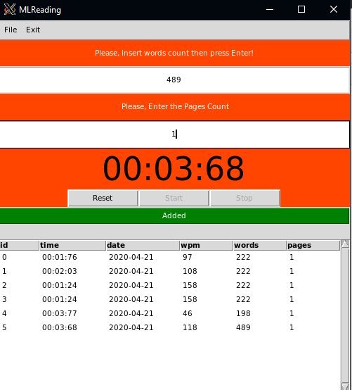

# Person Reading Speed  
This project will make it easier for you to keep your reading data.

## Will be added in the future
- shortcut buttons for start and stop timer
- ML algorithm for training and prediction.

## Will come soon
- run on windows10
- adding menus that working on python ( the menus works on windows10)
- create own data that machine learning predict user reading time

# a formula that calculate words per second WPM with a source
(minutes) *60 + seconds =  seconds to read pageseconds to read page
wpm = (words on page / seconds to read page)  * 60 

## average reading speed for adults 
* 0-100      - > way below average
* 100-199    - > below average
* 200-299    - > average
* 300-399    - > above average (a few readers are here)
* 400-600+   - > doctorate degree level
* 1000-2000+ - > extreme rare - professional speed reader

## Source 
* [The Daily Dabble](https://the-daily-dabble.com/calculate-words-per-minute-reading-speed/) - to explains calculate of wpm
* [Penandthepad](https://penandthepad.com/calculate-words-per-minute-reading-7563359.html) - to explains calculate of wpm
## GUI Image Snapshot 

